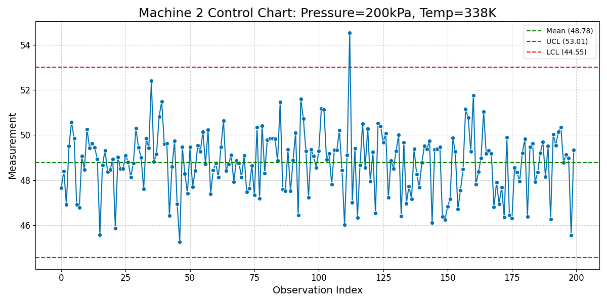
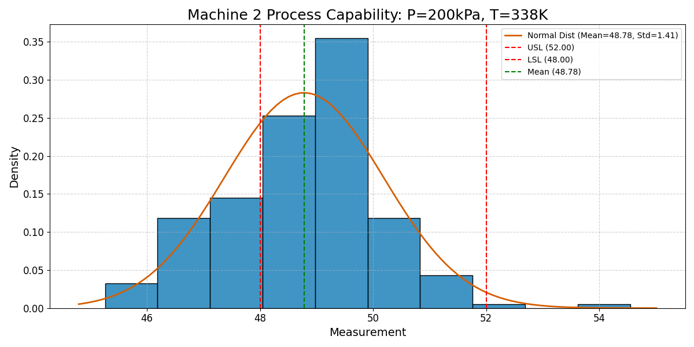
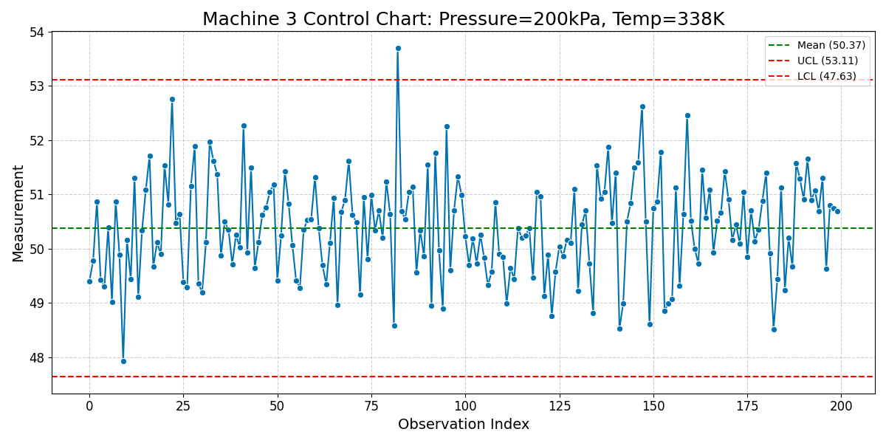
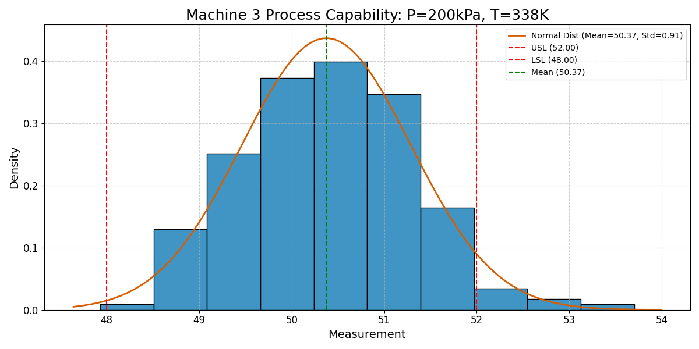
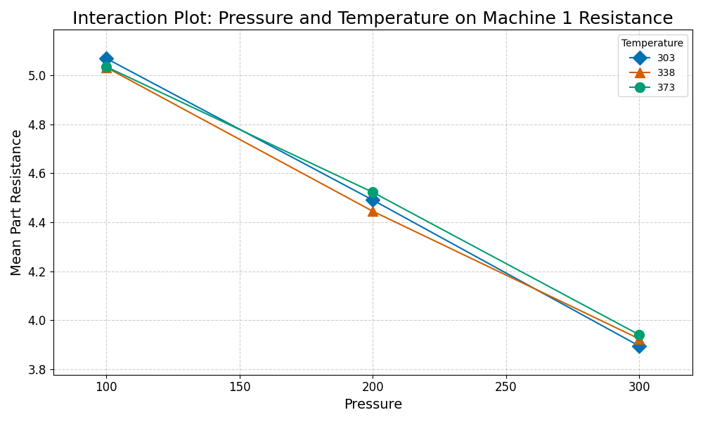

---

## Control Chart: Machine 2 (P=200kPa, T=338K)


---

## Process Capability: Machine 2 (P=200kPa, T=338K)


---

## Cpk Calculation: Machine 2 (P=200kPa, T=338K)
Cpk for Machine 2: 0.184

---

## Capability Assessment: Machine 2
Cpk = 0.184

**Conclusion:** Machine 2 is: Not Capable (Cpk < 1.33).

---

## Control Chart: Machine 3 (P=200kPa, T=338K)


---

## Process Capability: Machine 3 (P=200kPa, T=338K)


---

## Cpk Calculation: Machine 3 (P=200kPa, T=338K)
Cpk for Machine 3: 0.593

---

## Capability Assessment: Machine 3
Cpk = 0.593

**Conclusion:** Machine 3 is: Not Capable (Cpk < 1.33).

---

## Slide 19: ANOVA: Significance of Pressure (Machine 1 Resistance)
ANOVA Table (excerpt for Pressure):
```
             sum_sq    df        F  PR(>F)
C(Pressure) 379.688 2.000 1042.069   0.000
```
Pr(>F) for Pressure: 0.000

**Conclusion:** Is Pressure significant for Machine 1 Resistance? **Yes**
(Significance level alpha = 0.05)

---

## Slide 20: ANOVA: Significance of Temperature (Machine 1 Resistance)
ANOVA Table (excerpt for Temperature):
```
                sum_sq    df     F  PR(>F)
C(Temperature)   0.314 2.000 0.862   0.423
```
Pr(>F) for Temperature: 0.423

**Conclusion:** Is Temperature significant for Machine 1 Resistance? **No**
(Significance level alpha = 0.05)

---

## Slide 21: ANOVA: Significance of Pressure*Temperature Interaction (Machine 1 Resistance)
ANOVA Table (excerpt for Pressure*Temperature Interaction):
```
                            sum_sq    df     F  PR(>F)
C(Pressure):C(Temperature)   0.673 4.000 0.924   0.449
```
Pr(>F) for P*T Interaction: 0.449

**Conclusion:** Is P*T interaction significant for Machine 1 Resistance? **No**
(Significance level alpha = 0.05)

---

## Slide 22: Interaction Plot: Pressure and Temperature on Machine 1 Resistance

